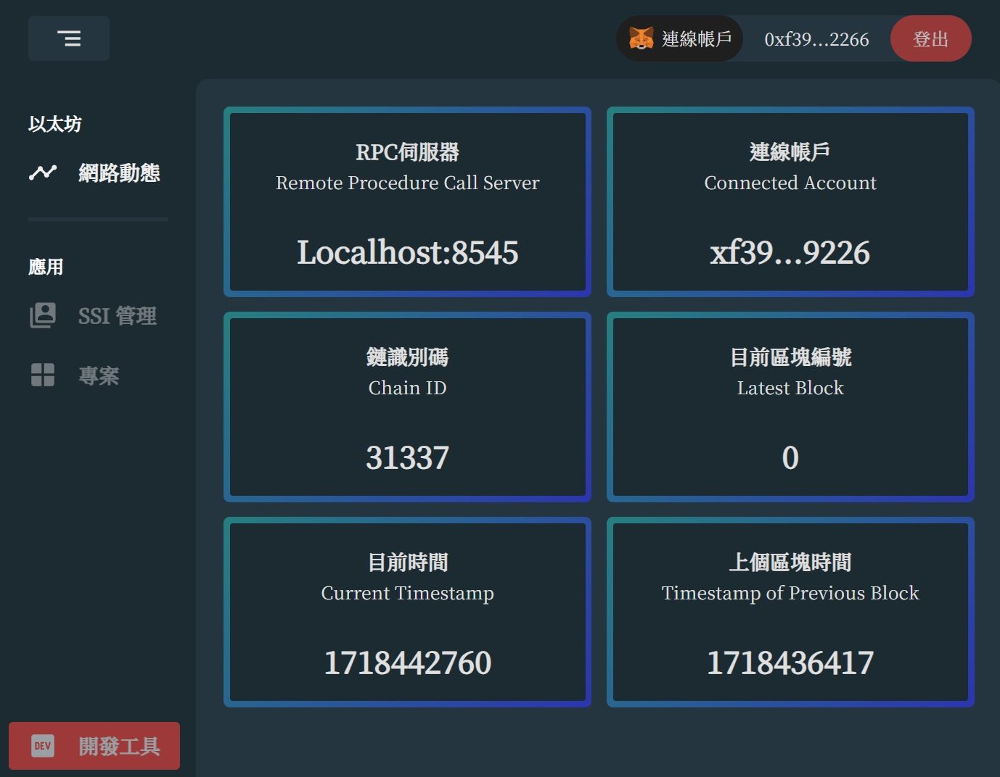
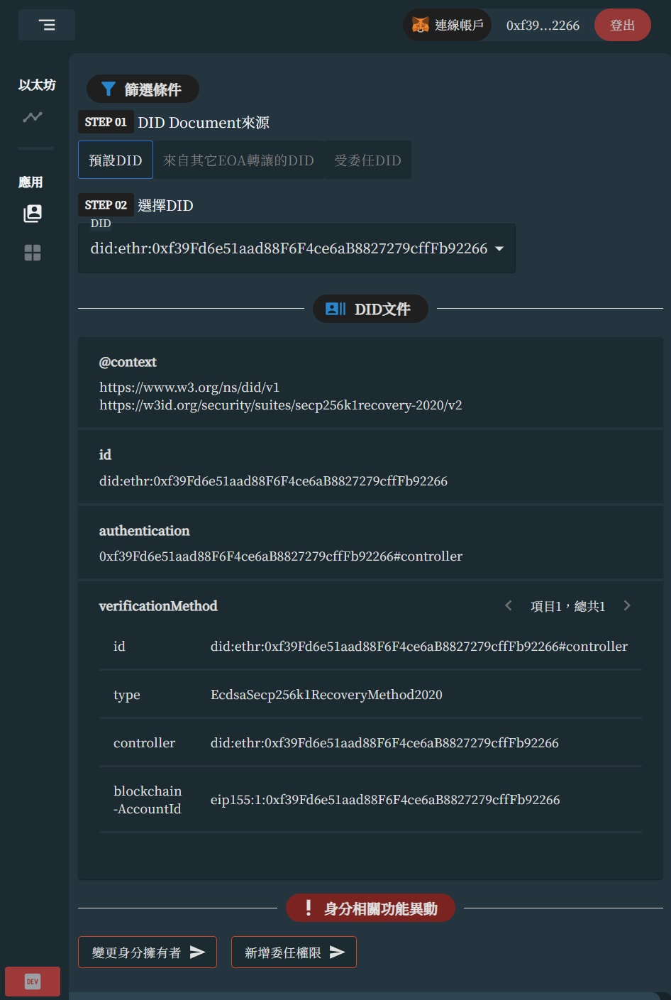
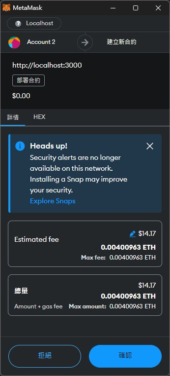
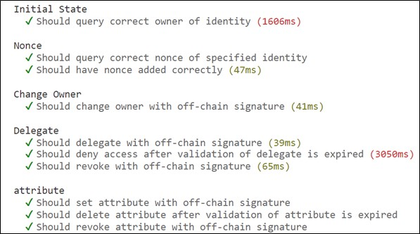

# CRA and Node.js 以太坊去中心化識別值管理系統

## 目錄

- [簡介](#簡介)
- [系統畫面](#系統畫面)
- [安裝](#安裝)
- [單元測試](#單元測試)

## 簡介

這個專案是由 CRA 建立，後續交由 Node.js 專案控管，除管理前端框架外，也負責處理以太坊交易等候端資料流。完成了以太坊社群訂定的[ERC-1056 標準](https://eips.ethereum.org/EIPS/eip-1056)，這項標準的訂定是在以太坊下建立使用者管理系統，並且達成完全去中心化，身分的生命週期全交由使用者控制，也就是相對於 Web2.0 下帳號背後還是有第三方權威控管。這個標準的實現是藉由智慧合約達成，但由於單看智慧合約內容並不是那麼直覺，因此本專案開發 React 提供前端的使用者操作介面。

如果要讓這個專案正常運作，環境的架設必須包含如下三個元件：

- Hardhat 使用者端以太坊網路：模擬以太坊主網路，提供交易提交
- React 伺服器：Host 請求與回應
- MetaMask 以太坊錢包（瀏覽器套件）：Web3 登入入口，若是未安裝此套件，則進不去後台管理頁面

## 系統畫面



當登入後台畫面時，可以直接看到分頁分成四個，如下說明：

- 網路動態：監控自己架設的使用者端以太坊網路運行情況
- SSI 管理：以太坊身分控管，包含移轉及委任身分，該頁面回傳回來的資料都是調用
- 專案：基於 SSI 上的應用延伸，實際狀況為繼承 SSI 的智慧合約
- 開發工具：一些開發工具方便開發者測試



上圖的 SSI 管理頁面的資料回傳來自於，查詢網路歷史交易過後的狀態，底下兩個異動按鈕的觸發在填入參數無誤後，都可發行交易，實現身分的異動

## 安裝

在 clone 專案後，執行以下指令:

1. 在專案目錄建立檔案 `yarn.lock`.
2. 執行 `yarn install` 安裝必須相依套件.
3. （選擇性）至 https://app.tryethernal.com/ 註冊專案，這個網站提供 API 連接，以 GUI 方式監控部署的以太坊網路狀態. 建立玩專案後編輯目錄下的 `.env` 填入欄位 **ETHERNAL_API_TOKEN** 以及 **ETHERNAL_EMAIL**.

```
# 範例
REACT_APP_DID_REGISTRY=0xabcdef123456...
ETHERNAL_API_TOKEN=eyAbC123Def456...
```

4. 瀏覽器安裝 Metamaskd 擴充套件.
5. 終端機輸入`npx hardhat node`啟動以太坊網路.
6. 終端機輸入`yarn start`啟動 React 伺服器.
7. 由於 MetaMask 預設連接到以太坊主網路，而我們的專案是運作在自己部署的使用者端網路，因此，我們需要在 MetaMask 套件上面自定義新增網路，參數如下  
   
8. 登入 Web 帳戶後，進到「開發工具」頁面，部署 ERC-1056 合約，可至終端機檢視部署結果
   
9. 編輯目錄底下‵.env`填入所部署的合約位址至 **REACT_APP_DID_REGISTRY**欄位

```
REACT_APP_DID_REGISTRY=0xe7f1725e7734ce...
```

8. 重啟 React 伺服器.

## 單元測試

設計兩個使用者，互相移轉身分功能，初始值設計如下

```
async function deployContractFixture() {
  const [eoaAlice, eoaBob] = await ethers.getSigners();
  const contract = await ethers.deployContract("EtherDIDRegistrySignedOnly");

  return { contract, eoaAlice, eoaBob };
}
```

接續執行了共 10 項單元測試，確定智慧合約個函數調用正常運行，所有函數的發行皆符合以太坊的「personal_sign」安全簽署方法，下方程式碼為其中一項代表性單元測試，查看全部可至[testContract](./test/testContract.js)查看

```
describe("Change Owner", function () {
  it("Should change owner with off-chain signature", async function () {
    const { contract, eoaAlice, eoaBob } = await loadFixture(
      deployContractFixture
    );

    const hash = …合併簽署訊息並雜湊，參考表4.3
    const (v, r, s) = …鏈下簽署訊息並分解簽署訊息，參考表4.4
    // 發行交易
    await contract.changeOwnerSigned(eoaAlice.address, v, r, s, eoaBob.address);

    expect(await contract.identityOwner(eoaAlice.address)).to.equal(
      eoaBob.address
    );
  });
});
```


